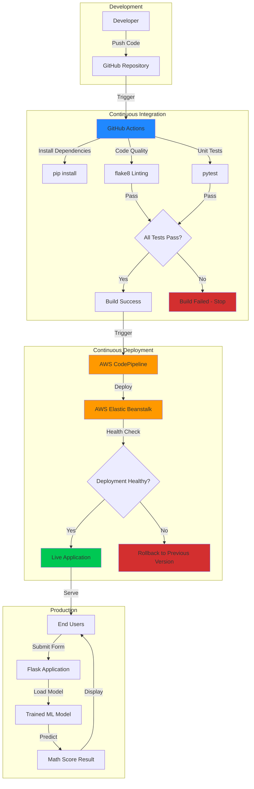

# Student Performance Indicator

A production-ready **end-to-end** machine learning web application that predicts student math scores based on demographic and academic factors. While the ML model itself is straightforward, this project focuses on building a complete engineering pipeline that takes a notebook experiment and turns it into a deployable, maintainable system.

> **Live Demo (Deployed App):** [student-performance-indicator](http://student-performance-indicator-v2-env.eba-bpbyphtg.us-east-2.elasticbeanstalk.com/)

## Why I Built This

I've seen too many data science projects that end their life in a Jupyter notebook. To be honest, that's how I've been learning so far and it's definitely fun. I have a really nice model, the metrics look good, all of that. But there's no path from experiment to production. I wanted to solve that gap.

This project started as a learning exercise to answer one question: what does it actually take to deploy a machine learning model in a way that scales? The student performance prediction model is intentionally simple because the real work here is everything around it—the data pipeline, the testing infrastructure, the web interface, and the deployment automation.

## What It Does

The application predicts a student's math exam score based on:
- Demographic information (gender, ethnicity)
- Parental education level
- Lunch program participation
- Test preparation course completion
- Reading and writing test scores

Users fill out a web form, and the model returns a predicted score. Simple interface, reliable predictions, production-grade infrastructure.

## Project Architecture



## Tech Stack

**Core Language & Framework**
- Python
- Flask

**Machine Learning & Data Science**
- Scikit-learn (Model selection, cross-validation, training and evaluation)
- Pandas (Data manipulation)
- Numpy (Numerical computing)
- XGBoost (Gradient boosting models)

**Development & Testing**
- pytest (Unit testing framework)
- flake8 (Code quality and style checking)
- dill (Model serialization)

**Visualization & Analysis** *(Notebooks)*
- Matplotlib (Data Visualization)
- Seaborn (Data Visualization)
- Jupyter Notebook

**Cloud Infrastructure**
- AWS Elastic Beanstalk (Application hosting)
- AWS CodePipeline (Continuous deployment)
- GitHub Actions (Continuous integration)

### How the Pipeline Works

When I push code to GitHub:

1. **GitHub Actions** kicks off immediately, installing dependencies and running quality checks
2. **Linting** with flake8 catches code style issues before they reach production (PEP8 Conventions)
3. **Unit tests** with pytest validate core functionality (if pages are loading correctly, etc.)
4. **AWS CodePipeline** detects the commit and triggers automatic deployment
5. **Elastic Beanstalk** handles the actual deployment, scaling, and health monitoring

The entire process is automated. If tests fail, deployment stops. If deployment fails, the previous version stays live.

---


 GitHub Actions workflow run showing all checks passing

---

## Project Structure

```
├── .github/
│   └── workflows/          # CI/CD configuration files
├── artifact/               # Data storage (train/test splits)
├── logs/                   # Application logs
├── notebook/              
│   ├── eda.ipynb          # Exploratory data analysis
│   └── model_training.ipynb
├── src/
│   ├── components/
│   │   ├── data_ingestion.py
│   │   ├── data_transformation.py
│   │   └── model_trainer.py
│   ├── pipeline/
│   │   ├── predict_pipeline.py
│   │   └── train_pipeline.py
│   ├── exception.py       # Custom exception handling
│   ├── logger.py          # Logging configuration
│   └── utils.py           # Shared utilities
├── templates/             # HTML templates
├── application.py         # Flask application entry point
├── requirements.txt       # Python dependencies
├── setup.py              # Package configuration
└── test_application.py   # Unit tests
```

## About the Model

I'll be honest and state the model and the dataset is basic. I got the data from a CSV file, ran it through my data transformation and model training pipelines, ran GridSearchCV on a list of models with various hyperparamters and compared R2 Scores. The winning model on my training set is actually a simple Linear Regression that got an R2 Score of 89%. The accuracy is decent but not groundbreaking. That's intentional.

My motives for this project didn't invovlve building the world's best student performance predictor. They were about demonstrating that I can take any model, no matter how simple or complex, and build production infrastructure around it. The engineering pipeline I've built here could just as easily serve a deep learning model or an ensemble of dozens of estimators.

The model is a means to an end. The pipeline is the point.

---

**
 AWS Elastic Beanstalk environment dashboard showing "Health: Ok" status in green

---

## Application Interface

The web interface is intentionally minimal. Users input student information through a clean form with proper validation, hit submit, and get an instant prediction. No gimmicks here.

---


The home page showing the modern UI with the prediction form


A completed prediction showing the result

---

## Local Installation

Clone the repository:
```bash
git clone https://github.com/yourusername/student-performance-indicator.git
cd student-performance-indicator
```

Create and activate a virtual environment:
```bash
python -m venv venv
.\venv\Scripts\Activate.ps1  # Windows PowerShell
# or
source venv/bin/activate      # macOS/Linux
```

Install dependencies:
```bash
pip install -r requirements.txt
```

Run the application:
```bash
python application.py
```

Visit `http://127.0.0.1:5000` in your browser.

## Deployment Pipeline

The application uses a two-stage CI/CD pipeline:

**Stage 1: GitHub Actions (Continuous Integration)**
- Automatically runs on every push to main branch
- Installs dependencies from requirements.txt
- Runs flake8 for code quality checks
- Executes pytest test suite
- Only proceeds if all checks pass

**Stage 2: AWS CodePipeline → Elastic Beanstalk (Continuous Deployment)**
- Monitors GitHub repository for changes
- Automatically pulls latest code
- Deploys to Elastic Beanstalk Python environment
- Performs health checks before marking deployment as successful
- Automatically rolls back if health checks fail

---


AWS CodePipeline showing successful deployment stages (Source Success → Deploy Success)

---

## Manually Running Tests

Execute the test suite:
```bash
pytest test_application.py -v
```

Check code quality:
```bash
flake8 src/ --max-line-length=120
```

## What I Learned

Building this taught me that deployment is way harder than modeling. Handling edge cases, managing dependencies, writing tests, setting up CI/CD pipelines are the skills that separate an experimentation notebook from a functioning product.

I also learned to appreciate simplicity. My first version of this project had three times as many files and twice as many dependencies. I couldn't even deploy it on AWS since it required too much memory for my free plan. So I stripped it down to what actually matters. Every file in this repo serves a purpose and is easily scalable.

I plan to use a similar project structure for any future ML/MLOps project since I love the reusability and scalability of my structure.

## Future Improvements

This project is functional but not finished. Here's what I'd do next:

**Containerization:** Dockerizing the application would make deployment even more reliable and portable across different cloud providers.

**Model Monitoring:** Add logging for prediction drift and model performance degradation over time.

**Retraining Pipeline:** Automate model retraining when new data becomes available, with A/B testing between model versions.

**Better Frontend:** The current UI is clean but minimal. A React frontend with real-time validation would improve the user experience.

## Technologies Used

- **Python** (Flask, scikit-learn, pandas, NumPy)
- **AWS** (Elastic Beanstalk, CodePipeline)
- **GitHub Actions** (CI/CD)
- **pytest** (Testing)
- **flake8** (Code quality)

## License

This project is open source and available under the MIT License.

---

Built with the understanding that shipping is a feature.
